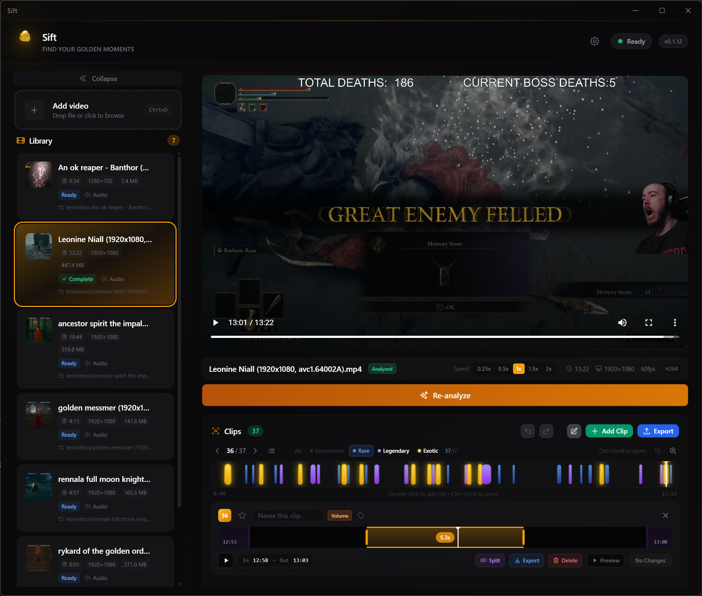
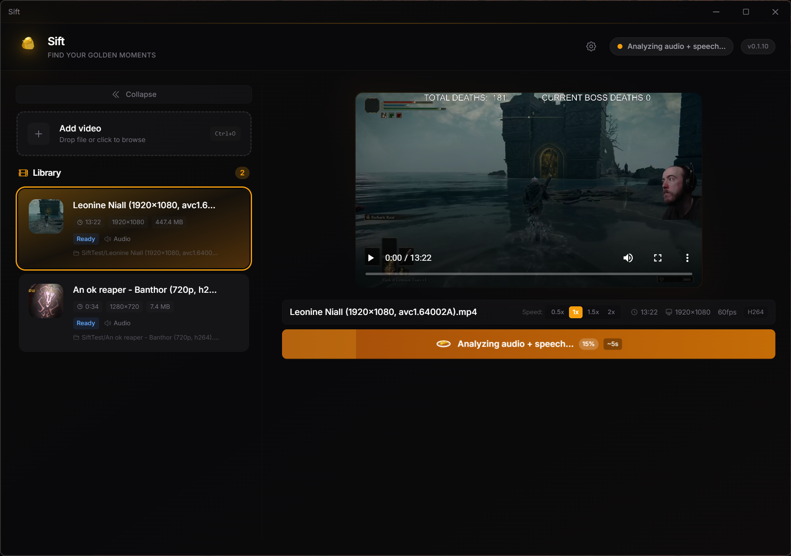
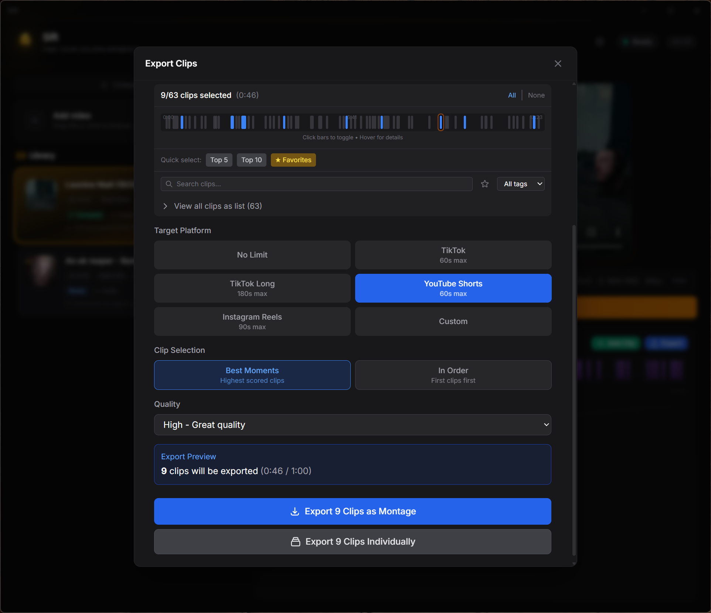

# ✨ Sift

### Sift through your footage. Find the gold.

**Automatically detect the best moments in your gaming footage — 100% local, 100% free.**

---

## 🎮 What is Sift?

Sift analyzes your gameplay recordings and automatically finds exciting moments — clutch plays, funny fails, highlight-worthy clips. No cloud uploads, no accounts, no subscriptions.

**Stop scrubbing through hours of footage.** Let Sift find the gold.

 

## ⚡ Features

| Feature | Description |
|---------|-------------|
| 🎯 **Smart Detection** | Finds moments using voice activity, volume spikes, and visual motion analysis |
| 👁️ **Visual Detection** | Detects clip-worthy moments even during silence — silent reactions, action without commentary |
| ✂️ **Clip Trimming** | Fine-tune boundaries with drag handles and live preview |
| 🏷️ **Organization** | Name, tag, and favorite your clips — batch rename supported |
| 🎬 **Montage Export** | Export individual clips or merge multiple into one video |
| 📱 **Platform Presets** | Quick export for TikTok, YouTube Shorts, Instagram Reels |
| 🎨 **Quality Tiers** | S/A/B/C quality ranking with estimated file sizes |
| 🔍 **Timeline Zoom** | Zoom into the timeline for precise navigation between clips |
| 🎬 **NLE Integration** | Send timelines to DaVinci Resolve, Premiere Pro, or Vegas Pro |
| 📋 **FCPXML & EDL Export** | Import clip timelines into any NLE editor |
| 📁 **Watch Folders** | Auto-import videos from specified folders |
| 🔄 **Auto Updates** | Stay current with one-click updates and a What's New summary |
| ⌨️ **Keyboard Shortcuts** | Full keyboard navigation — J/K/L, space, arrows, Ctrl+Z/Y |
| ↩️ **Undo/Redo** | Undo any edit with Ctrl+Z — trim, delete, rename, all reversible |
| 🌙 **Dark UI** | Clean, modern interface designed for content creators |

 

## 📥 Installation

1. **Download** the latest installer from [Releases](https://github.com/JashVaidya/sift-release/releases/latest)
2. **Run** the installer
3. **Launch** Sift from the Start Menu

> **Note:** Windows SmartScreen may show a warning since the app isn't signed with a paid certificate. Click "More info" → "Run anyway" to proceed. This is normal for indie software.

 

## 🚀 How It Works

1. **Drop** — Drag & drop or browse for video files (MP4, MKV, MOV, AVI, WEBM)
2. **Analyze** — Sift detects exciting moments using audio and visual analysis
3. **Review** — Browse clips on a zoomable timeline, adjust boundaries, add names and tags
4. **Export** — Export individual clips, create montages, or send timelines to your NLE

  

  

 

## 💻 System Requirements

| Component | Requirement |
|-----------|-------------|
| OS | Windows 10/11 (64-bit) |
| RAM | 8 GB minimum |
| Storage | 300 MB for app |
| GPU | Not required (CPU-based) |

 

## 🗺️ What's Coming

We're actively building Sift toward v1.0. Here's what's on the horizon:

| Version | Theme | Highlights |
|---------|-------|------------|
| **v0.3** | Smart Detection | Custom sound cue training, per-game profiles, improved visual analysis |
| **v0.4** | Editing Power | Multi-moment trimmer, transitions, text overlays, audio ducking |
| **v0.5** | Organization | Projects, tagging system, search & filter, bulk operations |
| **v0.6** | Performance | GPU-accelerated export, background analysis, large file optimization |
| **v0.7** | Sharing | Direct upload to YouTube/TikTok, link sharing, thumbnail generation |
| **v1.0** | Release | macOS support, full polish, onboarding flow |

Have a feature request? [Open an issue](https://github.com/JashVaidya/sift-release/issues) — we read every one.

 

## 🔄 Updates

Sift checks for updates automatically. When a new version is available, you'll see a notification — click to install with one click. After updating, a **What's New** modal shows you exactly what changed.

 

## 🐛 Found a Bug?

Report issues on the [Issues page](https://github.com/JashVaidya/sift-release/issues).

Please include:
- What you were doing when the bug occurred
- Any error messages you saw
- Your Windows version

 

## 📜 License

© 2026 Jash Vaidya. All rights reserved.

---

Made with ❤️ for content creators

